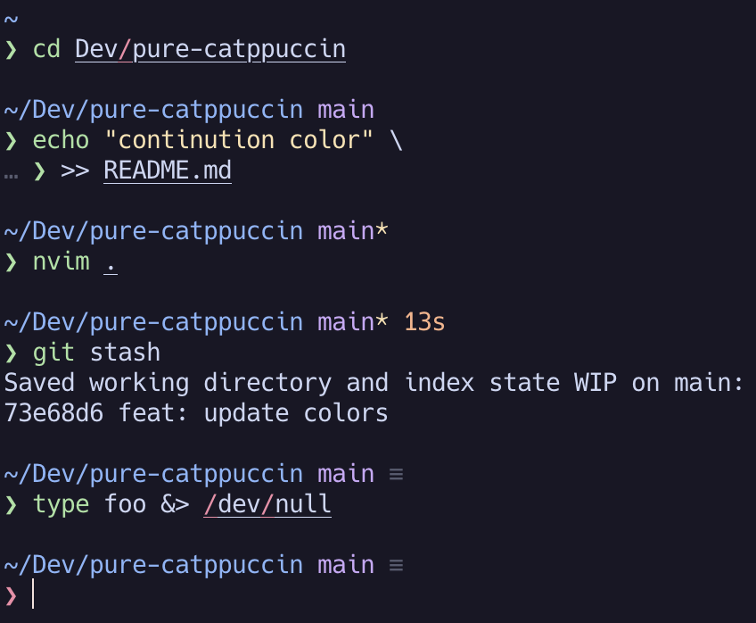

# Pure Catppuccin

My personal preference of colour choices for [Pure](https://github.com/sindresorhus/pure) ZSH prompt.

Requires a terminal with support for RGB colours like iTerm2.

<p align="center">
  
</p>

## Installation

```sh
zplug p-m-p/pure-catppuccin, use:style/latte.zsh
# or
zplug p-m-p/pure-catppuccin, use:style/frappe.zsh
# or
zplug p-m-p/pure-catppuccin, use:style/macchiato.zsh
# or
zplug p-m-p/pure-catppuccin, use:style/mocha.zsh
```
