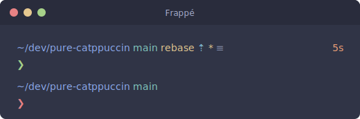
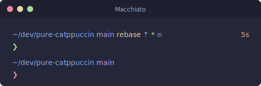
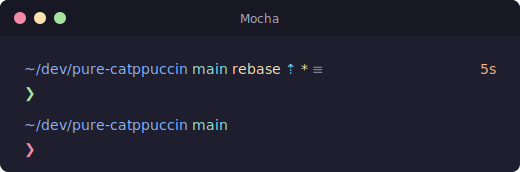

# Pure Catppuccin

My personal preference of colour choices for [Pure](https://github.com/sindresorhus/pure) ZSH prompt.

Requires a terminal with support for RGB colours like iTerm2.

<details>
<summary>Latte</summary>

</details>

<details>
<summary>Frappé</summary>

</details>

<details>
<summary>Macchiato</summary>

</details>

<details>
<summary>Mocha</summary>

</details>

## Installation

### Manual

After setup of Pure prompt, clone this repo and...

```sh
cd pure-catppuccin
source style/mocha.zsh # or latte.zsh, frappe.zsh, macchiato.zsh
```

### ZPlug

```sh
zplug p-m-p/pure-catppuccin, from:github, at:main, use:style/mocha.zsh # or latte.zsh, frappe.zsh, macchiato.zsh
```
